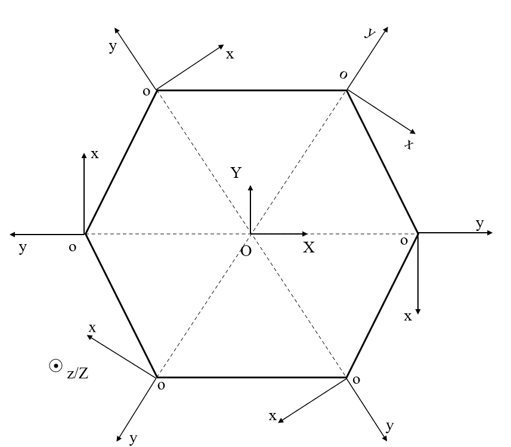
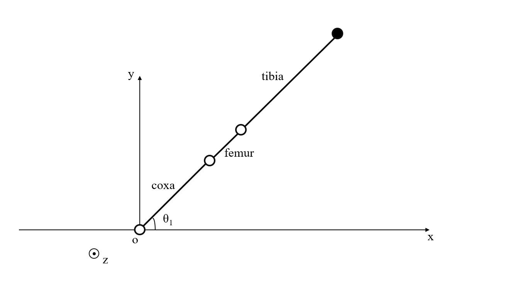
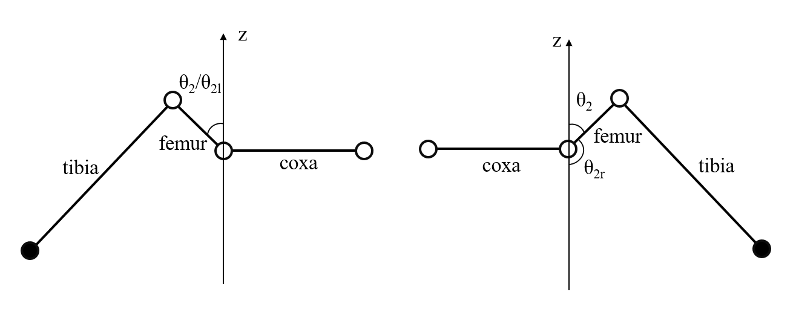
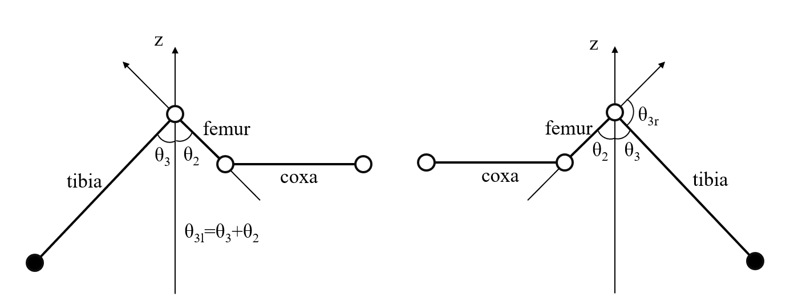

# Coordinate settings

## Leg

### Coordinate of a leg

**Origin Point:** The intersection point of the **top plate plane** and the **axis of coxa**.

**z-axis:** Perpendicular to the horizontal plane, pointing **upward**.

**y-axis:** Parallel to the line from the origin of the regular hexagon to the origin of the coordinates of the leg, and points **outward** radially.

**x-axis:** Determined according to the **right-hand** system.

### Angles defination

**$\theta_1$:** Angle between **coxa** and **x-axis**. Consistent with the servo output of coxa joint.

**$\theta_2$:** Angle between **femur** and **z-axis**.

>**Note**
>
>**In order to align the modeling angle with the servo output angle, use $\theta_{2l}$ and $\theta_{2r}$ when involving servo control.**
>
>*For left leg: $\theta_{2l}$ is the angle between femur and positive z-axis.*
>
>*For right leg:$\theta_{2r}$ is the angle between femur and negative z-axis.*

**$\theta_3$:** Angle between **tibia** and **z-axis**.

>**Note**
>
>**In order to align the modeling angle with the servo output angle, use $\theta_{3l}$ and $\theta_{3r}$ when involving servo control.**
>
>*For left leg: $\theta_{3l} = \theta_2 + \theta_3$*
>
>*For right leg: $\theta_{3r} = \pi - (\theta_2 + \theta_3)$*

#### Brief summary

add human readable angle

"some table here"

